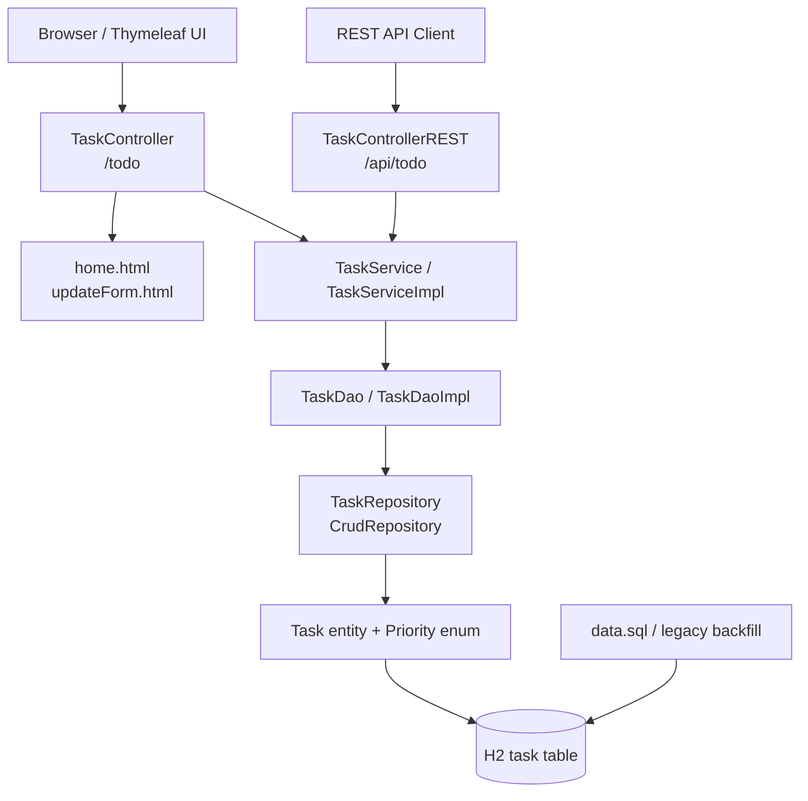
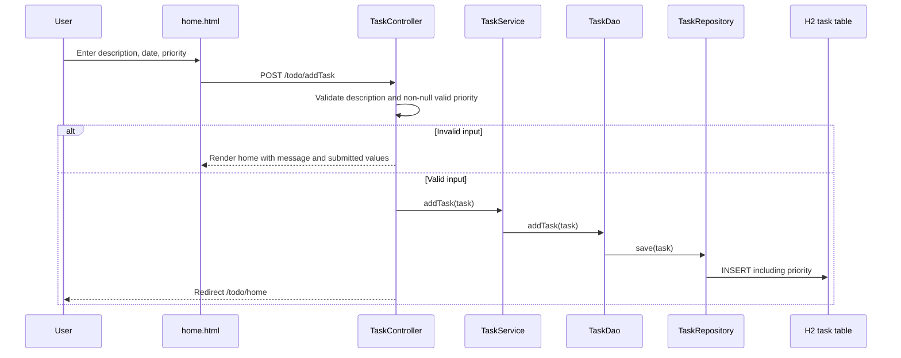
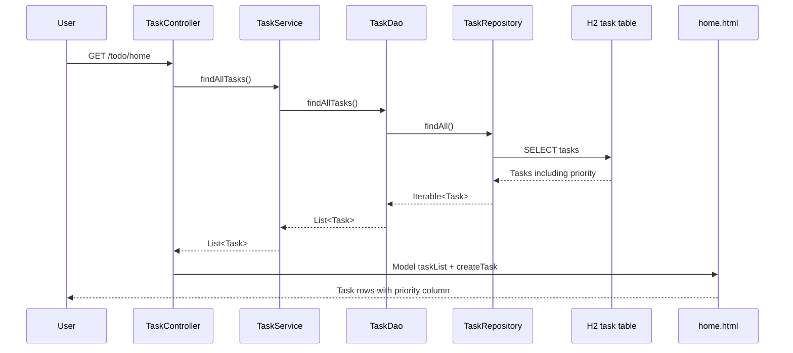
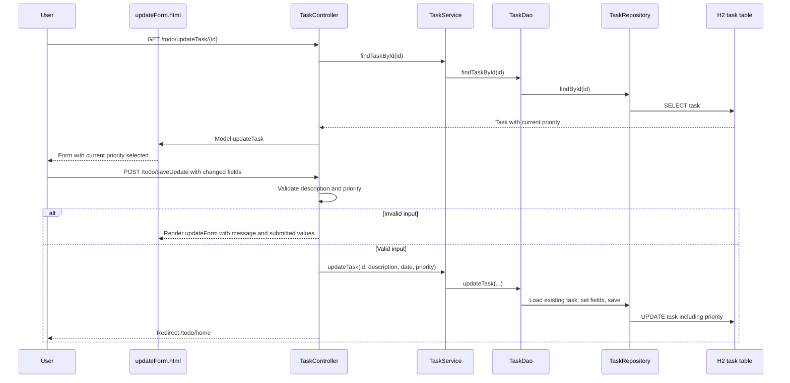

# Task Priority Management Architecture

**Project:** Mini Todo Application  
**Architecture step:** Step 2 — Architecture  
**Requirements baseline:** `docs/requirements.md`  
**Status:** Approved after human review

## 1. Architecture goals and constraints

This design adds task priority to the existing Spring Boot application without replacing its current structure or introducing a new application framework. It follows the approved requirements:

- New tasks must explicitly provide `HIGH`, `MEDIUM`, or `LOW`; there is no new-task default.
- Priority is supported through both the Thymeleaf web UI and the REST API.
- Existing tasks receive `MEDIUM`.
- The task list displays priority but does not sort or filter by it.
- Existing IDs, descriptions, dates, routes, CRUD behavior, and validation remain intact.

The current application uses Spring Boot 2.3.0.RELEASE, Java 11, Spring MVC, Thymeleaf, Spring Data JPA, an H2 in-memory database, and the existing entity -> repository -> DAO -> service -> controller flow. The Maven project already contains the web, Thymeleaf, JPA, validation, H2, and test dependencies needed for this enhancement.

## 2. Current implementation baseline

### Application components

| Component | Current responsibility | Priority change |
|---|---|---|
| `domain.Task` | JPA entity containing generated `id`, `description`, and date `date` | Add a type-safe priority property and persistence mapping. |
| `dao.TaskRepository` | Spring Data `CrudRepository<Task, Integer>` | No new query is required; inherited persistence handles the additional entity column. |
| `dao.TaskDao` | CRUD abstraction | Extend update operations to carry priority. |
| `dao.TaskDaoImpl` | Delegates CRUD to `TaskRepository`; updates description and date | Persist priority on create and update; retain existing fields. |
| `service.TaskService` | Application service contract | Extend update contract to carry priority. |
| `service.TaskServiceImpl` | Delegates service calls to the DAO | Forward priority without adding a second persistence path. |
| `controller.TaskController` | `/todo` web routes, description checks, and Thymeleaf model setup | Bind, validate, and pass priority; expose it to both templates. |
| `controller.TaskControllerREST` | `/api/todo` JSON CRUD endpoints | Validate priority for create/update and return it through normal task serialization. |
| `templates/home.html` | Creates and lists tasks | Add a required priority selector and a priority column. |
| `templates/updateForm.html` | Edits description and date | Add the current priority and selectable values. |
| `resources/data.sql` | Seeds one task without priority | Seed legacy/sample data with `MEDIUM` after the schema supports priority. |
| `TodoAppApplicationTests` | Verifies only context startup | Retain it and add focused persistence, web, REST, validation, and migration tests in Step 5 — Implementation. |

`TaskRepository` does not need a priority-specific finder because sorting and filtering are explicitly out of scope. The existing task-list retrieval remains the source of list order.

## 3. Proposed high-level architecture

The enhancement is an additive vertical slice:

1. A single domain priority type defines the only accepted values.
2. `Task` stores that type using a string database representation.
3. The existing DAO and service contracts carry priority on create/update.
4. Both controllers use the same domain validation rules.
5. Thymeleaf binds the selected value to the task model; REST uses the same task JSON property.
6. The database schema is extended and legacy rows are backfilled to `MEDIUM` before the application exposes migrated data.

No separate priority service, repository, endpoint, table, sorting layer, or UI framework is needed.

### Component diagram



## 4. Type-safe priority and database approach

### Domain representation

Use a Java enum named `Priority` with exactly:

```text
HIGH
MEDIUM
LOW
```

The `Task.priority` property should use this enum. Persistence should use JPA `EnumType.STRING`, not ordinal storage. String storage keeps database values stable if enum declaration order changes and makes H2 records readable.

The enum is the domain boundary for validation:

- `null` means no priority was supplied and is invalid for a new task or update request.
- Only the three enum constants are valid.
- No arbitrary strings, custom values, or additional levels are accepted.
- Web labels may be rendered as `High`, `Medium`, and `Low`, while the canonical API/database values remain uppercase.

The implementation should not normalize non-canonical REST values unless the same behavior is deliberately specified and tested. The approved baseline therefore treats unsupported or malformed values as invalid.

### Database representation

Add a `priority` column to the existing `task` table, represented as text. The final schema should require a non-null value for all persisted tasks once legacy rows have been backfilled.

The current application uses an in-memory H2 database and does not include Flyway or Liquibase. Therefore, adding a migration framework is unnecessary for this enhancement. The implementation must nevertheless use a deterministic, idempotent schema/data initialization strategy that:

1. Makes the new column available.
2. Converts existing null/missing values to `MEDIUM`.
3. Ensures the application does not expose migrated tasks with null priority.
4. Seeds the current `data.sql` task with `MEDIUM`.

For the current H2 startup sequence, the priority column must be available as nullable while legacy rows are loaded and backfilled. The seed insert must explicitly include `priority = 'MEDIUM'`; relying on an omitted column or a runtime default would violate the no-default rule and can fail once a non-null constraint is introduced. A startup backfill must then set any remaining null values to `MEDIUM` before normal task reads and writes. The backfill must be idempotent and scoped only to null legacy values.

For a future durable database, the equivalent deployment migration should add the column, backfill `MEDIUM`, and then enforce `NOT NULL`. The current H2 implementation should enforce the same invariant through initialization ordering and validation; a database-level `NOT NULL` constraint may be applied after backfill if the selected schema initialization mechanism can guarantee that ordering. The implementation must not make startup depend on inserting a row that omits a required column.

## 5. Data-flow design

### Create through the web UI



The controller must not assign `MEDIUM` when the form omits priority. `MEDIUM` is reserved for legacy-data migration.

### View through the web UI



The existing list retrieval and ordering are preserved. No priority query, sort, or filter is introduced.

### Update through the web UI



The DAO update must load the existing entity and update the intended fields so ID, description, date, and priority are not accidentally discarded.

### Create, view, and update through REST

```mermaid
flowchart LR
    Client[REST client JSON]
    RC[TaskControllerREST]
    Validation[Server-side priority validation]
    Service[TaskService]
    DAO[TaskDao]
    Repository[TaskRepository]
    DB[(H2 task table)]
    Response[JSON task with priority]

    Client -->|POST /api/todo/add| RC
    Client -->|PUT /api/todo/update/{id}| RC
    Client -->|GET /api/todo/task/{id} or /tasksList| RC
    RC --> Validation
    Validation -->|valid| Service
    Validation -->|missing/blank/unsupported| Error[4xx validation response]
    Service --> DAO --> Repository --> DB
    DB --> Repository --> DAO --> Service --> RC --> Response
```

For POST and PUT, request binding and server-side validation occur before persistence. For GET, the entity's priority is serialized as part of the additive task representation. DELETE remains unchanged and does not need a priority-specific path. Invalid enum text that fails JSON binding must be converted to the same documented 4xx error shape as a bound-but-invalid or missing priority; it must not leak a framework-specific response shape.

The generated `id` is server-owned for REST create operations, and the update path variable is authoritative. A client-supplied body ID must not redirect an update to another task or overwrite task identity.

## 6. Existing-task migration without new-task defaulting

Migration and new-task creation are separate responsibilities:

- **Legacy migration:** When the upgraded schema encounters rows with no priority, it explicitly updates those rows to `MEDIUM`. This is data repair for records created before the feature.
- **New task creation:** Controllers reject a missing priority. They must not use `MEDIUM` as a fallback and must not persist a task until validation succeeds.

The recommended migration sequence is:

1. Add the text priority column in a migration-compatible, temporarily nullable state.
2. Backfill all existing null values to `MEDIUM`, preserving every existing ID, description, and date.
3. Update seed data in `data.sql` to include `MEDIUM`.
4. Enforce non-null priority for the final schema where the deployment database supports that constraint.
5. Verify that list and GET responses contain a valid priority for every task.

Because the current H2 database is in-memory, the seed row is recreated on application initialization and is not durable between restarts. The same backfill rule remains necessary for any rows present during initialization and for a future persistent deployment.

## 7. Validation and error handling

### Web UI

- Add a required priority control with exactly three options.
- Validate again on the server; HTML `required` is not sufficient.
- Missing, blank, malformed, or unsupported priority must not call the service persistence method.
- On create validation failure, render `home` with the existing task list, an error message, and submitted valid values where possible.
- On update validation failure, render `updateForm` with the submitted task and an error message.
- Preserve the existing description checks: numeric-only descriptions and descriptions shorter than five characters remain invalid.
- Do not silently convert invalid or missing new-task priority to `MEDIUM`.

### REST API

- Bind priority to the same type-safe domain representation.
- Reject missing, blank, unsupported, or malformed values before DAO persistence with a meaningful 4xx response.
- Use one application-level validation error shape for controller validation failures and JSON binding failures, including the field (`priority`) and a human-readable message.
- Do not return a success response for an invalid priority.
- Preserve existing fields and endpoint paths.
- Requests for nonexistent IDs should retain the application's existing behavior; priority handling must not create a task implicitly.

The current controllers do not define a centralized exception handler or explicit not-found response. Step 5 — Implementation should add only the smallest targeted exception handling needed for priority validation and enum binding, producing the same 4xx error shape without broad catches or unrelated API redesign. Existing not-found behavior should remain unchanged unless required by an existing test or the approved requirements.

## 8. Backward compatibility

- Existing web routes remain `/todo/home`, `/todo/addTask`, `/todo/updateTask/{id}`, `/todo/saveUpdate`, `/todo/deleteTask/{id}`, and `/todo/backHome`.
- Existing REST routes remain under `/api/todo`.
- `id`, `description`, and `date` remain present and retain their current meaning and formats.
- Priority is additive to REST JSON; existing response messages and CRUD operations remain.
- Task-list order remains the repository's existing order; no priority ordering is introduced.
- Existing description validation remains unchanged.
- Legacy records are made valid by an idempotent explicit `MEDIUM` backfill, not by a runtime default on every newly bound task.
- `data.sql` must explicitly insert `MEDIUM` for its seed row and remain compatible with the initialization ordering.

## 9. Testing architecture and considerations

The current `contextLoads()` test should remain as a smoke test. Step 5 — Implementation should add focused tests using the existing Spring Boot test dependencies rather than introducing another test framework.

### Domain and persistence tests

- Verify all three enum values persist and load as strings.
- Verify a task stores priority with unchanged ID, description, and date.
- Verify update changes only intended fields and persists the new priority.
- Verify legacy null values are backfilled to `MEDIUM`.
- Verify seed data loads with a valid priority.

### Web MVC tests

- GET `/todo/home` includes task priority in the model/view.
- Create accepts each valid priority and persists it.
- Missing priority is rejected and does not call persistence.
- Update displays the current value selected.
- Update changes priority without losing existing task fields.
- Invalid priority redisplays the correct form with an error.
- Existing description validation and redirects remain intact.

### REST tests

- POST `/api/todo/add` accepts each valid priority and returns it.
- PUT `/api/todo/update/{id}` changes priority and retains description/date behavior.
- GET endpoints include priority for one task and task lists.
- Missing, blank, unsupported, and malformed priority values receive 4xx responses and are not persisted.
- DELETE behavior remains unchanged.

### Regression and integration checks

- Run the existing context test and the new focused tests together.
- Verify `home.html` and `updateForm.html` render with migrated and newly created tasks.
- Verify no additional query is used to display priority.
- Verify no sorting or filtering appears in the list.

## 10. Assumptions and unresolved design decisions

### Assumptions

- The current package structure and dependency set remain unchanged.
- A Java enum persisted with `EnumType.STRING` is acceptable as the canonical domain and database representation.
- Uppercase enum names are the canonical REST and database values; UI labels may be title-cased.
- The application will continue to use H2 for the current capstone deployment.
- The existing controller/service/DAO method style will be extended rather than replaced by DTOs or a new architecture.

### Design decisions resolved by review

1. **Schema initialization mechanism:** Do not add Flyway/Liquibase. Keep the H2 priority column temporarily nullable during startup, update `data.sql` to include `MEDIUM`, and run an idempotent null-only backfill before normal use. Apply a final non-null database constraint only if the selected initialization ordering can guarantee it safely.
2. **REST error shape:** Use one targeted application-level 4xx validation response for missing/invalid priority and JSON enum-binding failures. It must identify `priority` and provide a human-readable message.
3. **Case handling:** Reject non-canonical REST values; accept only `HIGH`, `MEDIUM`, and `LOW`. Web labels remain title-cased presentation text.
4. **Web error preservation:** Bind the submitted task, retain its submitted priority and other valid values on validation failure, and render the existing form with an error. Do not replace it with a new default task.
5. **Required update priority:** Require a non-null valid priority on web and REST updates after legacy backfill. Never use `MEDIUM` as a request-time fallback.

These resolutions clarify implementation choices without changing the approved requirements.

## 11. Human-in-the-loop gate

This architecture document was explicitly approved by the human stakeholder after review. No production code, tests, templates, Maven configuration, or other repository files were modified for Step 2. Step 4 — Implementation Planning may proceed; Step 5 — Implementation remains subject to the approved plan and its applicable approval gates.
